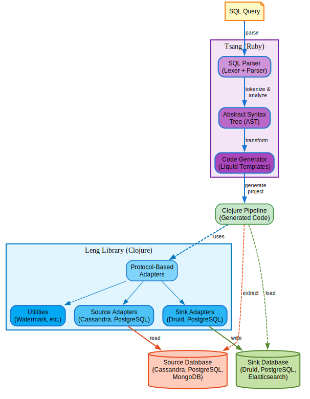

# TNL (Tsang + Leng)

A complete data pipeline development toolkit: Parse SQL queries and generate production-ready Clojure data pipelines.

**TNL = Tsang (SQL Parser) + Leng (Universal Database Library)**

## Overview

TNL automates the creation of data pipelines by transforming SQL queries into fully functional Clojure applications. It eliminates boilerplate code and enables rapid development of ETL pipelines, data migrations, and cross-database synchronization workflows.

### Architecture

<p align="center">
  
</p>

## Components

### Tsang - SQL Parser & Code Generator

Tsang is a Ruby-based SQL parser that converts SQL queries into an Abstract Syntax Tree (AST) and generates complete Clojure pipeline projects.

**Key Features:**
- Full SQL parsing (SELECT, INSERT, UPDATE, DELETE)
- AST export to JSON
- Pipeline code generation from SQL
- Batch generation for multiple pipelines
- Template-based code generation using Liquid

**Example:**
```bash
./tsang/bin/tsang generate \
  --sql "SELECT user_id, event_time, event_type FROM events.tracking" \
  --name tracking-pipeline
```

Generates a complete Clojure project in `./build/tracking-pipeline/`

[→ Full Tsang Documentation](./tsang/README.md)

### Leng - Universal Database Library

Leng is a Clojure library providing a unified interface for working with multiple database systems through protocol-based adapters.

**Key Features:**
- Protocol-based adapter pattern for extensibility
- Source adapters: Cassandra, PostgreSQL, MongoDB
- Sink adapters: Druid, PostgreSQL, Elasticsearch
- Watermark management for incremental loading
- Connection pooling and error handling
- Transaction support where available

**Supported Operations:**
- Query building with fluent API
- Batch operations
- Incremental data loading with watermarks
- Schema transformations
- Cross-database data movement

[→ Full Leng Documentation](./leng/README.md)

## Quick Start

### Prerequisites

- Ruby 3.0+ (for Tsang)
- Clojure 1.12+ (for generated pipelines)
- Database drivers for your sources/sinks

### Installation
```bash
# Clone the repository
git clone <repository-url>
cd tnl

# Install Tsang dependencies
cd tsang
gem install liquid
chmod +x bin/tsang

# Test Tsang
./bin/tsang parse --sql "SELECT * FROM users" --pretty
```

### Generate Your First Pipeline

1. **Create a configuration file** (`config.json`):
```json
{
  "batch_size": 5000,
  "watermark_enabled": true,
  "timestamp_column": "created_at",
  "id_column": "event_id",
  "source_type": "cassandra",
  "sink": {
    "type": "druid",
    "table": "users_analytics"
  }
}
```

2. **Generate the pipeline:**
```bash
cd tsang
./bin/tsang generate \
  --sql "SELECT user_id, created_at, email FROM users.profiles" \
  --name user-analytics \
  --config config.json
```

3. **Run the generated pipeline:**
```bash
cd build/user-analytics

# Set environment variables
export CASSANDRA_HOST=localhost
export CASSANDRA_USER=cassandra
export CASSANDRA_PASSWORD=cassandra
export DRUID_URL=http://localhost:8888
export DRUID_USER=admin
export DRUID_PASSWORD=admin

# Run incremental load
clj -M:run incremental
```

## Common Use Cases

### 1. Database Migration

Move data from legacy database to modern analytics platform:
```bash
./tsang/bin/tsang generate \
  --sql "SELECT * FROM legacy.orders WHERE created_at > '2024-01-01'" \
  --name orders-migration \
  --config migration-config.json
```

### 2. Real-time Analytics Pipeline

Sync operational data to analytics database:
```bash
./tsang/bin/tsang generate \
  --sql "SELECT event_time, user_id, event_type, properties FROM events.tracking" \
  --name analytics-pipeline \
  --config analytics-config.json
```

### 3. Cross-Database ETL

Extract from PostgreSQL, transform, load to Druid:
```bash
./tsang/bin/tsang generate \
  --sql "SELECT created_at, customer_id, amount, status FROM sales.transactions" \
  --name sales-etl \
  --config sales-config.json
```

### 4. Batch Processing Multiple Tables

Generate pipelines for multiple tables at once:
```bash
./tsang/bin/tsang batch_generate --batch batch-config.json
```

**batch-config.json:**
```json
{
  "pipelines": [
    {
      "name": "users-pipeline",
      "sql": "SELECT * FROM users.profiles",
      "config": { "source_type": "postgres", "sink": { "type": "druid" } }
    },
    {
      "name": "events-pipeline",
      "sql": "SELECT * FROM events.tracking",
      "config": { "source_type": "cassandra", "sink": { "type": "druid" } }
    }
  ]
}
```

## Project Structure
```
tnl/
├── README.md                   # This file
├── tsang/                      # SQL Parser & Code Generator
│   ├── README.md
│   ├── bin/tsang              # CLI tool
│   ├── lib/
│   │   ├── tsang.rb           # SQL parser
│   │   ├── lexer.rb
│   │   ├── parser.rb
│   │   ├── cli.rb
│   │   ├── ast/               # AST node definitions
│   │   └── codegen/           # Code generation
│   ├── templates/             # Liquid templates
│   └── spec/                  # Tests
├── leng/                       # Universal Database Library
│   ├── README.md
│   ├── deps.edn
│   └── src/gm/
│       ├── source/            # Source adapters
│       │   ├── cassandra.clj
│       │   ├── postgres.clj
│       │   └── mongodb.clj
│       ├── sink/              # Sink adapters
│       │   ├── druid.clj
│       │   ├── postgres.clj
│       │   └── elasticsearch.clj
│       └── utils/             # Utilities
│           └── watermark.clj  # Incremental loading
└── build/                      # Generated pipelines (git-ignored)
    └── my-pipeline/
        ├── deps.edn
        ├── src/pipeline.clj
        └── README.md
```

## Features

### Incremental Loading with Watermarks

Generated pipelines automatically track the last processed timestamp and only fetch new records:
```clojure
;; Generated code includes:
;; 1. Watermark file management
;; 2. Timestamp tracking
;; 3. Incremental query building
;; 4. Automatic resume on failure

clj -M:run incremental  ;; Processes only new records
clj -M:run full-reload  ;; Reprocesses all data
```

### Multi-Database Support

**Sources:**
- Cassandra (via Alia)
- PostgreSQL (via JDBC)
- MongoDB (coming soon)

**Sinks:**
- Apache Druid (real-time analytics)
- PostgreSQL (relational storage)
- Elasticsearch (coming soon)

### Flexible Configuration

Configure batch sizes, watermark columns, and database connections:
```json
{
  "batch_size": 10000,
  "watermark_enabled": true,
  "timestamp_column": "updated_at",
  "id_column": "event_id",
  "source_type": "cassandra",
  "sink": {
    "type": "druid",
    "table": "analytics_events",
    "default_url": "https://druid.example.com"
  }
}
```

### Production-Ready Code

Generated pipelines include:
- Proper error handling
- Connection management
- Logging with Logback
- Environment-based configuration
- Batch processing for large datasets
- Memory-efficient streaming

## Development

### Running Tests

**Tsang:**
```bash
cd tsang
bundle install
bundle exec rspec
```

**Leng:**
```bash
cd leng
clj -M:test
```

### Adding New Database Adapters

1. **Create adapter in Leng:**
```clojure
;; leng/src/gm/source/mydb.clj
(ns gm.source.mydb
  (:require [gm.source.core :as core]))

(defn create-adapter [] ...)
(defn connect [adapter config] ...)
(defn fetch [adapter query] ...)
(defn disconnect [adapter] ...)
```

2. **Update Tsang generator:**
```ruby
# tsang/lib/codegen/pipeline_generator.rb
def default_port_for(type)
  case type
  when :mydb then 5432
  # ...
  end
end
```

3. **Add template support if needed**

### Contributing

1. Fork the repository
2. Create a feature branch
3. Make your changes
4. Run tests
5. Submit a pull request

## Architecture Decisions

### Why Two Components?

**Tsang (Ruby):**
- Ruby excels at text processing and parsing
- Rich tooling ecosystem for DSLs
- Liquid templating is simple and powerful

**Leng (Clojure):**
- Clojure's immutable data structures perfect for ETL
- JVM access to all database drivers
- Functional programming ideal for data transformations
- REPL-driven development

### Why Code Generation?

- **Type Safety**: Generated code is type-checked by Clojure
- **Performance**: Compiled code, not interpreted
- **Customization**: Edit generated code for specific needs
- **Transparency**: See exactly what runs in production
- **No Runtime Dependencies**: Generated code is self-contained

## Roadmap

- [ ] MongoDB source adapter
- [ ] Elasticsearch sink adapter
- [ ] Support for JOINs across databases
- [ ] Schema evolution handling
- [ ] Data quality checks
- [ ] Metrics and monitoring
- [ ] Web UI for pipeline management
- [ ] Docker images for generated pipelines
- [ ] Kubernetes deployment templates

## License

- **Tsang**: MIT License
- **Leng**: Eclipse Public License 2.0
- **Generated Pipelines**: Inherit EPL 2.0 from Leng

See individual LICENSE files in component directories.

## Support

- Documentation: See component README files
- Issues: GitHub Issues
- Discussions: GitHub Discussions

## Credits

Built with:
- Ruby & RSpec
- Clojure & Leiningen
- Liquid Templates
- Alia (Cassandra driver)
- JDBC (PostgreSQL)
- Apache Druid

---

**TNL** - Transform SQL into Production Data Pipelines


## Sponsor

<div align="center">

### Proudly Sponsored by [Starless.io](https://starless.io)

<a href="https://starless.io">
  
</a>

**Starless.io** - Data Infrastructure & Analytics Platform

Starless.io provides enterprise-grade data infrastructure solutions, specializing in real-time analytics, data pipeline orchestration, and scalable data processing platforms.

TNL was developed to solve real-world data integration challenges faced by Starless.io customers, enabling seamless data movement across heterogeneous database systems.

[Learn more about Starless.io →](https://starless.io)

</div>

---

<div align="center">
  <sub>Built with ❤️ by the Starless.io team</sub>
</div>
